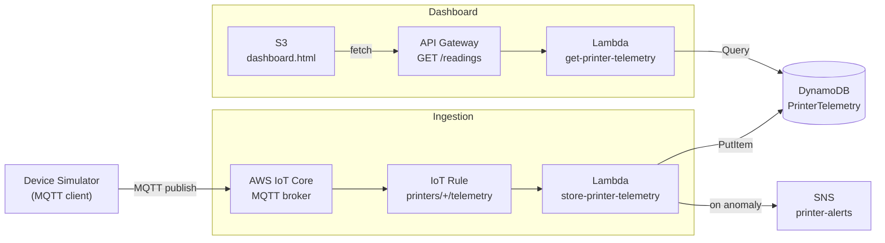

# Real-Time IoT Printer Monitoring & Anomaly Detection on AWS

An end-to-end IoT telemetry pipeline: a device simulator streams printer sensor readings over **MQTT**
to **AWS IoT Core**, a rule routes each message to **Lambda** for threshold-based anomaly detection
and storage in **DynamoDB**, **SNS** sends email alerts on anomalies, and a static **dashboard** on S3
visualizes live readings via **API Gateway**.

> Portfolio project demonstrating event-driven IoT architecture, pub/sub messaging, server-side
> anomaly detection, and real-time alerting — built hands-on with the AWS Console.

---

## Architecture



**Data flow**

1. The simulator publishes JSON telemetry to `printers/printer-001/telemetry` over MQTT (mutual TLS).
2. An IoT Rule (`SELECT * FROM 'printers/+/telemetry'`) forwards each message to the storage Lambda.
3. Lambda evaluates readings against thresholds, stores every item (with `isAnomaly` + `reason`), and
   publishes to SNS when an anomaly is detected.
4. The dashboard calls `GET /readings` on API Gateway, which queries DynamoDB and returns recent readings.

---

## Why these services

| Concern | Service | Why |
|---|---|---|
| Device connectivity | **AWS IoT Core** | Managed MQTT broker; mutual TLS auth; rules engine |
| Stream routing | **IoT Rule** | Serverless routing from topics to Lambda without a consumer process |
| Processing | **Lambda** | Per-message compute; scales with telemetry volume |
| Time-series storage | **DynamoDB** | `deviceId` + `timestamp` key design supports ordered queries per device |
| Alerting | **SNS** | Reliable pub/sub notifications (email/SMS) decoupled from processing |
| Dashboard API | **API Gateway + Lambda** | Managed HTTPS read endpoint with CORS |
| Dashboard UI | **S3 static website** | Cheap hosting for a simple monitoring page |

---

## Design decisions

- **MQTT over HTTPS for devices.** MQTT is lightweight, persistent, and bidirectional — the standard
  choice for continuous telemetry. HTTPS REST publish is publish-only and heavier per message.
- **Cloud-side anomaly detection.** Thresholds are evaluated in Lambda from raw sensor values; the
  device's self-reported `status` is stored for reference but not trusted as the source of truth.
- **Least-privilege IAM.** Separate Lambdas with scoped policies: `PutItem` for writes, `Query` for
  reads, `sns:Publish` only on the alert topic ARN.
- **Alerting never breaks ingestion.** SNS publish is wrapped in `try/except` — a failed alert does
  not prevent the reading from being stored.
- **Query, not Scan.** The read Lambda uses `Key("deviceId").eq(...)` with `ScanIndexForward=False`
  to fetch the newest readings efficiently.

---

## Repository layout

```text
iot-printer-monitoring/
├── README.md
├── .gitignore
├── simulator/
│   └── printer_simulator.py
├── lambda/
│   ├── store-printer-telemetry.py
│   └── get-printer-telemetry.py
├── iam/
│   ├── dynamodb-putitem.json
│   ├── dynamodb-query.json
│   └── sns-publish.json
├── frontend/
│   └── dashboard.html
└── screenshots/
```

---

## Telemetry schema

Each DynamoDB item:

```json
{
  "deviceId": "printer-001",
  "timestamp": "2026-07-09T20:32:09.093953+00:00",
  "nozzleTempC": 266.7,
  "bedTempC": 60.2,
  "vibration": 0.75,
  "status": "warning",
  "isAnomaly": true,
  "reason": "nozzle 266.7C > 235.0C; vibration 0.75 > 0.4"
}
```

**Anomaly thresholds (in storage Lambda):**

| Metric | Threshold |
|---|---|
| Nozzle temperature | > 235°C |
| Vibration | > 0.4 |

---

## Deploying it yourself (AWS Console summary)

1. **IoT Core** — register Thing `printer-001`, create certificate + policy, attach both.
2. **Simulator** — run `printer_simulator.py` locally with cert files (never commit certs).
3. **DynamoDB** — create `PrinterTelemetry` table (`deviceId` partition key, `timestamp` sort key).
4. **Lambda** — deploy `store-printer-telemetry.py`; attach `dynamodb-putitem.json` and
   `sns-publish.json` policies; set env var `ALERT_TOPIC_ARN` to the **topic** ARN (not subscription ARN).
5. **IoT Rule** — `SELECT * FROM 'printers/+/telemetry'` → action: invoke storage Lambda.
6. **SNS** — create `printer-alerts` topic; subscribe and confirm your email.
7. **Read path** — deploy `get-printer-telemetry.py`; attach `dynamodb-query.json`; create HTTP API
   with `GET /readings`; enable CORS.
8. **Dashboard** — upload `dashboard.html` to S3 static website hosting; set `API_BASE` to your
   API invoke URL.

---

## Known limitations / production notes

- **Alert debouncing.** The demo alerts on every anomalous reading (~every 30s with the simulator).
  Production would debounce (e.g., alert once per device per 5 minutes, or only on sustained breaches).
- **Scaling with Kinesis.** At low volume, IoT Core → Lambda direct is sufficient. At production scale
  (many devices, multiple consumers, replay needs), insert **Kinesis Data Streams** between IoT Core
  and processing for buffering, fan-out, and reprocessing.
- **HTTPS for dashboard.** The S3 website endpoint is HTTP-only. Production would use CloudFront.
- **Certificate security.** Device certs are secrets — keep them local, never in version control.

---

## Cost & cleanup

At demo volume, cost is approximately **$0** (free tier). To tear down: delete the IoT Thing/cert/policy,
DynamoDB table, both Lambdas, IoT Rule, SNS topic, API Gateway, and S3 bucket.

---

## What I learned

- MQTT pub/sub and mutual TLS device authentication with AWS IoT Core.
- IoT Rules as a serverless routing layer from device topics to compute.
- Cloud-side threshold anomaly detection (don't trust the client).
- DynamoDB composite keys for time-ordered queries per device.
- SNS topic ARN vs subscription ARN (a common IAM/env-var mistake).
- CORS between an S3 static site and API Gateway.
